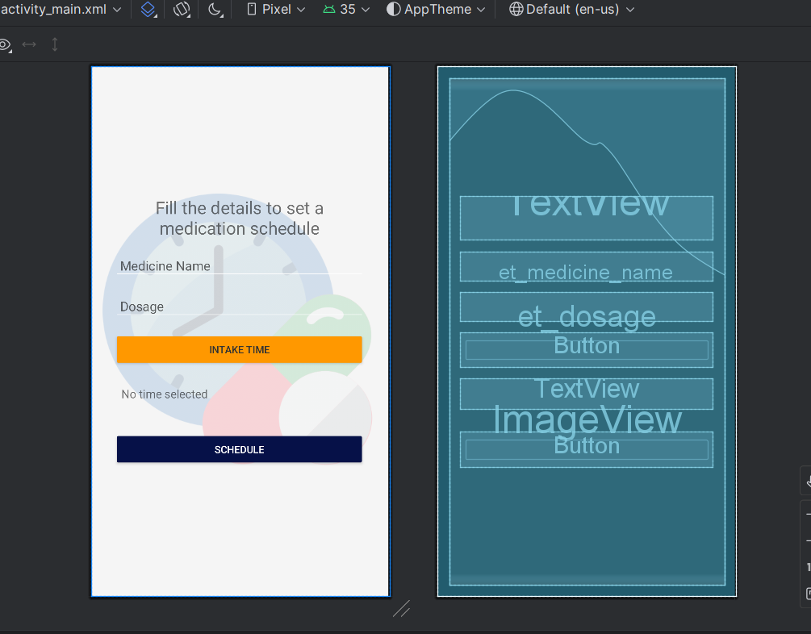
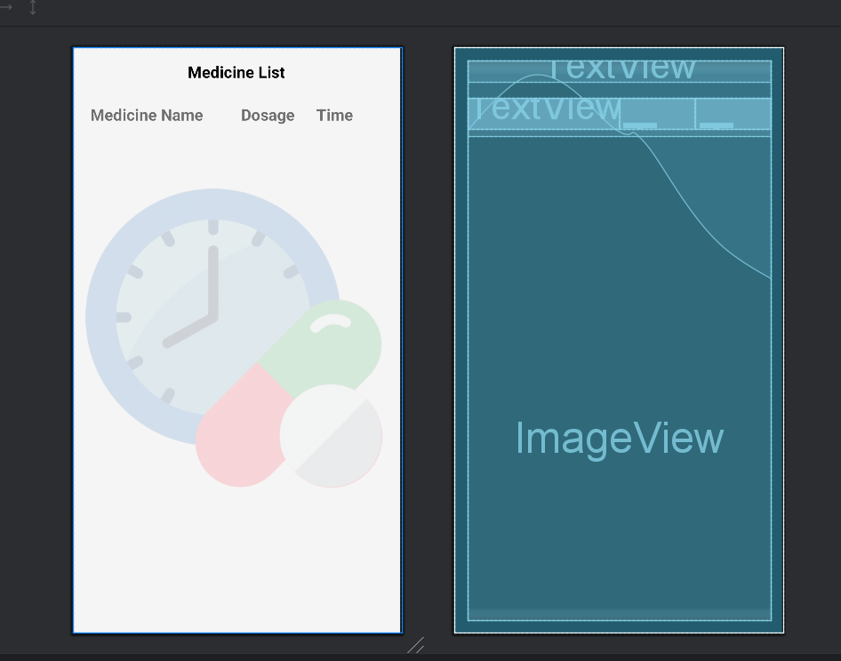
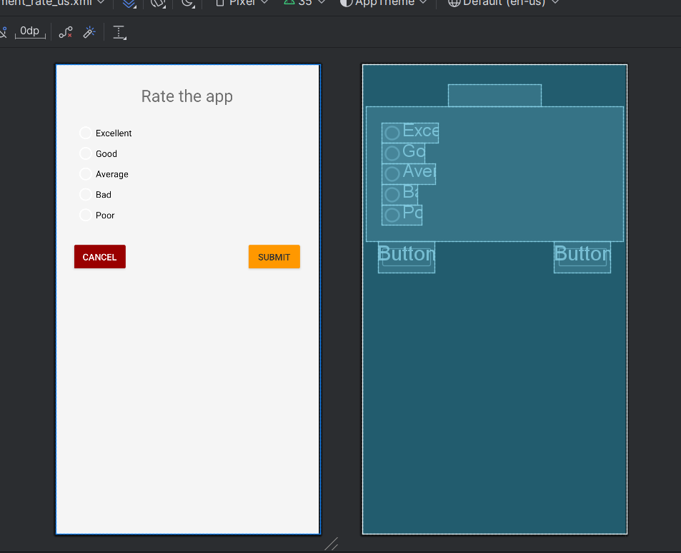
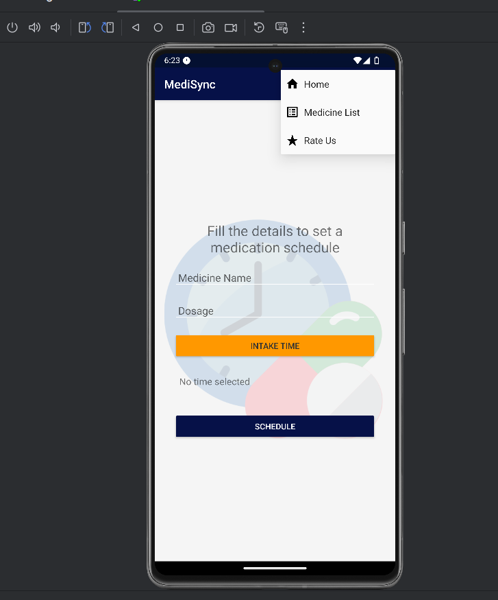
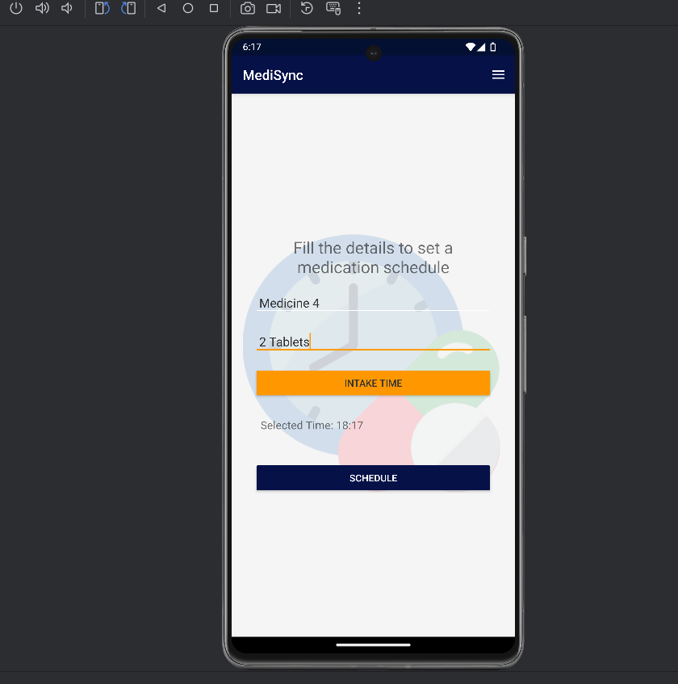
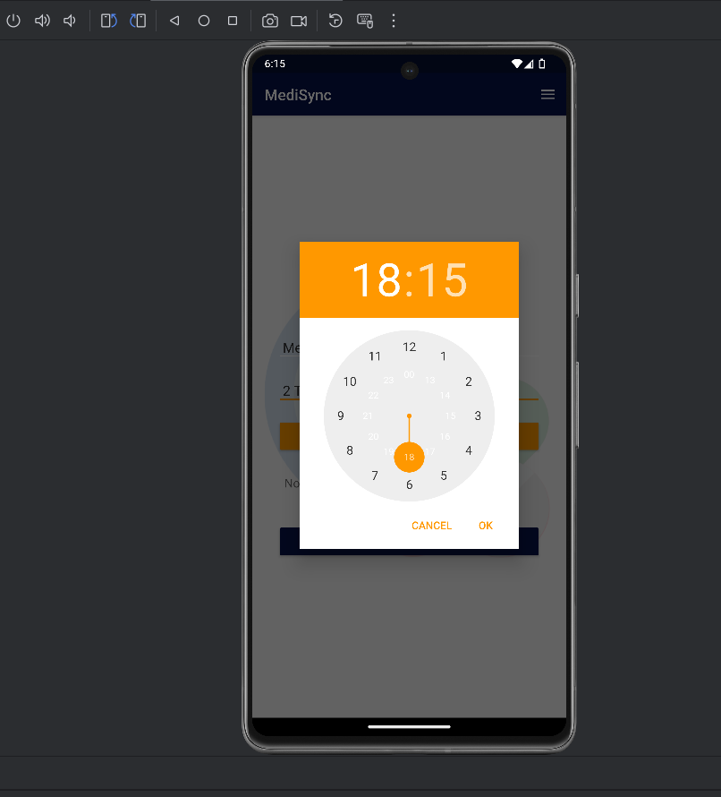
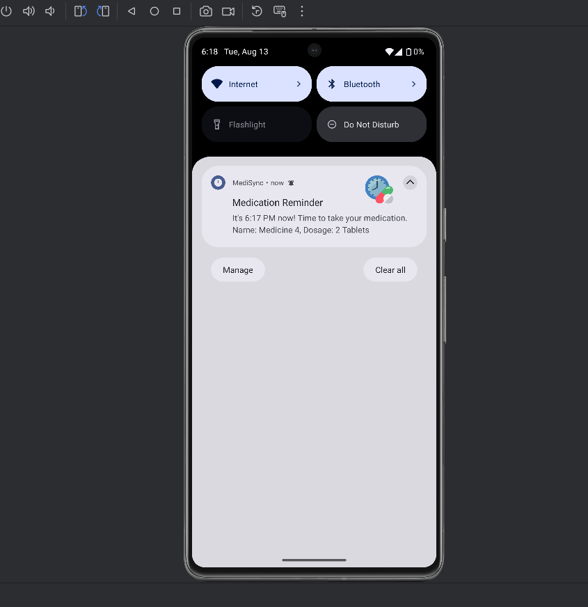
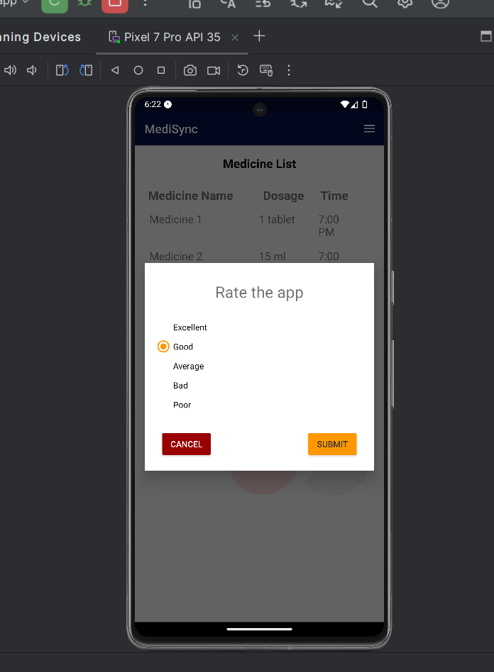
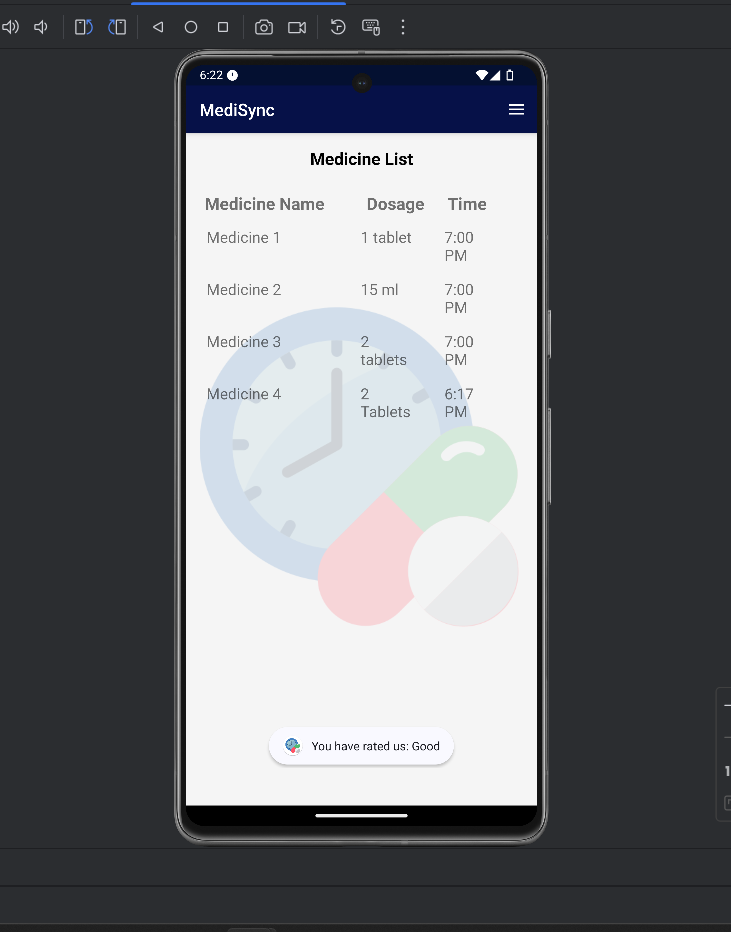

# MediSync - Medication Reminder App

MediSync is a Kotlin based Android app to help users manage their medication schedule efficiently. With MediSync, users can easily add medication details, set reminders, and get notified when it's time to take their medicine. The app also includes a rating system where users can provide feedback.

## Features

- **Add Medication**: Users can add the name, dosage, and intake time of their medicines.
- **Set Reminders**: The app allows users to set reminders for their medication to ensure that they never miss a dose. Reminders are sent as notifications, displaying the medication name, dosage, and intake time.
- **App Rating**: Users can rate the app to help improve its features.

## Design
<div align="center">
    
    
    
</div>


## Output
<div align="center">
    
    
    
    
    
    
</div>

## Demo Video
[Download the demo video of MediSync](https://raw.githubusercontent.com/anik-dutta/kotlin_medisync/main/media/demo-medisync.mp4)

## Technologies Used
* Kotlin
* Android Studio
* XML

## Installation
To run this app locally, follow these steps:

1. Clone the repository:
    ```bash
    git clone https://github.com/anik-dutta/kotlin_medisync.git
    ```
2. Open the project in [Android Studio](https://developer.android.com/studio).
3. Build and run the app on an emulator or physical device running Android.
